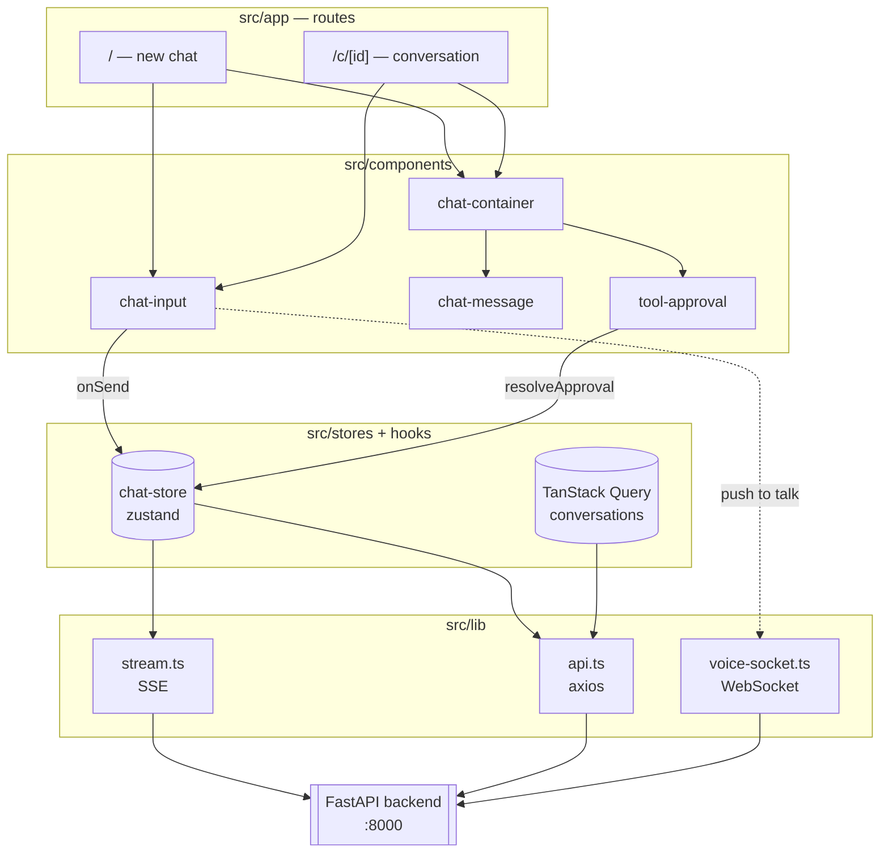

# RAG Assistant — Frontend

The web client for the [multi-agent RAG backend](../Naive-RAG-LangChain). A streaming
chat interface with document retrieval, tool calling with human approval, push-to-talk
voice, and persistent conversation history.

**Next.js 16** (App Router, Turbopack) · **React 19** · **TypeScript** · **Tailwind v4** ·
**Clerk** · **TanStack Query** · **Zustand**

> ⚠️ **This is not the Next.js you may know.** Version 16 renamed `middleware.ts` to
> `proxy.ts` and changed several conventions. Read
> [`AGENTS.md`](AGENTS.md) and the bundled docs in `node_modules/next/dist/docs/`
> before writing routing or navigation code.

---

## 📚 Documentation

| Document | What it covers |
|---|---|
| **[docs/architecture.md](docs/architecture.md)** | The complete picture — layers, state management, the provider tree, auth, and *why* each decision was made. Start here. |
| **[docs/workflow.md](docs/workflow.md)** | Every user journey end to end, and exactly how the frontend talks to the backend. Endpoint by endpoint. |
| **[docs/streaming-and-hil.md](docs/streaming-and-hil.md)** | SSE token streaming and the human-in-the-loop tool-approval flow, in depth. The most intricate part of the app. |
| [styles.md](styles.md) | The "Electric Minimal" design tokens and palette. |

---

## Quick start

```bash
npm install
npm run dev          # http://localhost:3000
```

The backend must be running on `http://localhost:8000` — see
[the backend readme](../Naive-RAG-LangChain/readme.md).

### Environment

Create `.env.local` (see [`.env.example`](.env.example)):

```bash
NEXT_PUBLIC_API_URL=http://localhost:8000     # where the FastAPI backend lives

NEXT_PUBLIC_CLERK_PUBLISHABLE_KEY=pk_test_... # Clerk (identity provider)
CLERK_SECRET_KEY=sk_test_...

# Required — without these, production sign-in loops forever
NEXT_PUBLIC_CLERK_SIGN_IN_URL=/sign-in
NEXT_PUBLIC_CLERK_SIGN_UP_URL=/sign-up
NEXT_PUBLIC_CLERK_AFTER_SIGN_IN_URL=/
NEXT_PUBLIC_CLERK_AFTER_SIGN_UP_URL=/
```

### Scripts

| Command | Does |
|---|---|
| `npm run dev` | Dev server with Turbopack and hot reload |
| `npm run build` | Production build (also runs a full TypeScript check) |
| `npm start` | Serve the production build |
| `npm run lint` | ESLint, including the React Compiler rules |

---

## Folder structure

```
frontend/
├── docs/                        ← the documents listed above
├── public/
│   └── pcm-worklet.js           AudioWorklet: mic Float32 → Int16 PCM for voice
│
└── src/
    ├── app/                     ROUTES (Next.js App Router)
    │   ├── layout.tsx           Root layout — the provider tree (order matters)
    │   ├── globals.css          Design tokens, theme, prose/typography setup
    │   ├── page.tsx             `/`          New chat + welcome screen (public)
    │   ├── c/[id]/page.tsx      `/c/{id}`    A single conversation
    │   ├── connectors/page.tsx  `/connectors` MCP integrations (all "coming soon")
    │   ├── profile/page.tsx     `/profile`   Account and profile editing
    │   └── sign-in|sign-up/     Clerk-hosted auth pages
    │
    ├── components/
    │   ├── chat/
    │   │   ├── chat-container.tsx    Scrolling message list + autoscroll
    │   │   ├── chat-message.tsx      Markdown rendering (tables, code, copy)
    │   │   ├── chat-input.tsx        Composer: text, send/stop, push-to-talk
    │   │   ├── tool-approval.tsx     The human-in-the-loop approval card
    │   │   └── message-skeleton.tsx  Loading and typing indicators
    │   ├── auth/
    │   │   ├── session-provider.tsx  Clerk token → backend session cookies
    │   │   ├── app-shell.tsx         Sidebar vs bare frame; blocks on session
    │   │   ├── user-menu.tsx         Avatar dropdown
    │   │   └── auth-backdrop.tsx     Decorative background for auth pages
    │   ├── ui/                       shadcn/ui primitives (button, dialog, …)
    │   ├── app-sidebar.tsx           Conversation list, rename, delete, nav
    │   ├── chat-header.tsx           Top bar: title, share, theme toggle
    │   ├── providers.tsx             Theme + TanStack Query + Toaster
    │   └── theme-toggle.tsx          Dark/light switch
    │
    ├── hooks/
    │   ├── use-conversations.ts      TanStack Query: list, rename, delete
    │   └── use-guarded-send.ts       Send + the sign-in detour + navigation
    │
    ├── lib/
    │   ├── api.ts                    Axios instance: cookies, refresh, retry
    │   ├── stream.ts                 SSE: streamChat, resumeChat, pending
    │   ├── voice-socket.ts           WebSocket + Web Audio for voice
    │   ├── connectors.ts             Static MCP catalogue
    │   ├── pending-prompt.ts         Carries a draft across sign-in
    │   └── utils.ts                  `cn()` class merger
    │
    ├── stores/                       Zustand — client state only
    │   ├── chat-store.ts             Messages, streaming, pending approval
    │   ├── voice-store.ts            Voice phase machine
    │   └── sidebar-store.ts          Sidebar open/closed
    │
    ├── types/
    │   ├── chat.ts                   Mirrors backend app/schemas/chat.py
    │   └── auth.ts                   Mirrors backend app/schemas/auth.py
    │
    └── proxy.ts                      Route protection (was `middleware.ts` ≤ v15)
```

---

## How the pieces fit



**The one rule that explains the state split:**

| Kind of state | Lives in | Why |
|---|---|---|
| Server data (conversation list) | **TanStack Query** | It is a cache of something the server owns. Needs invalidation, optimistic updates, and staleness — all of which Query does and a store would have to reinvent. |
| Live UI state (streaming text, pending approval) | **Zustand** | It is not on the server yet. It changes many times per second and must survive route changes without a refetch. |
| Identity | **Clerk + SessionProvider** | Clerk proves who you are; the backend decides what you may do and issues its own cookies. |

---

## Key behaviours worth knowing

**Streaming is Server-Sent Events, not plain text.** A turn can pause mid-answer to ask
for tool approval, so the stream carries named events (`token`, `interrupt`, `done`,
`error`). See [docs/streaming-and-hil.md](docs/streaming-and-hil.md).

**Auth is a two-step handshake.** Clerk signs you in, then `SessionProvider` exchanges
that token *once* for HttpOnly cookies from the backend. Every later request — including
the voice WebSocket — rides the cookie. No token is ever readable by client JavaScript.

**`/` is public on purpose.** A signed-out visitor sees the real chat UI, because for a
chatbot the interface *is* the pitch. The gate is at submit: the draft is stashed in
`sessionStorage`, the user signs in, and the prompt replays automatically.

**A new chat navigates on the response header,** not when the answer finishes. The
conversation id arrives on `X-Conversation-Id` before the first token, which is what
lets the URL become `/c/{id}` while text is still streaming.

---

## Adding things

| To add… | Do this |
|---|---|
| A page | New folder under `src/app/`. Add it to `isPublicRoute` in `proxy.ts` if it should be reachable signed-out. |
| A markdown element | New entry in the `components` map in `chat-message.tsx`. If it is a raw **HTML** tag, it must also be permitted by the sanitiser schema — see [architecture.md §6](docs/architecture.md#chat-messagetsx--markdown). |
| A backend call | A function in `src/lib/`, using the shared `api` instance from `api.ts` so cookies, refresh and retry apply. |
| A stream event type | Handle it in `dispatch()` in `stream.ts`, then in the store's handlers. |
