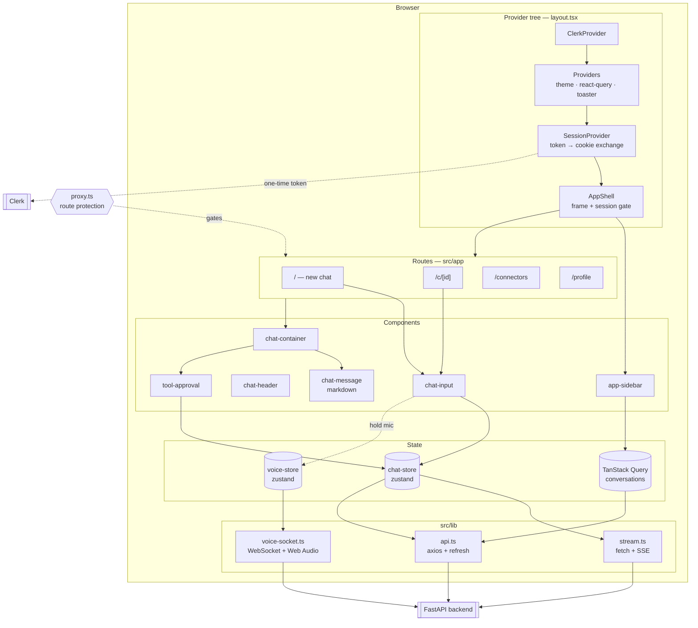
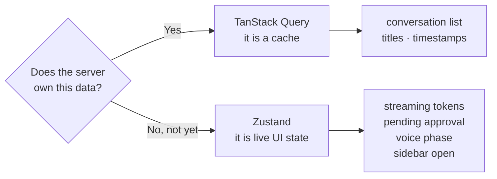
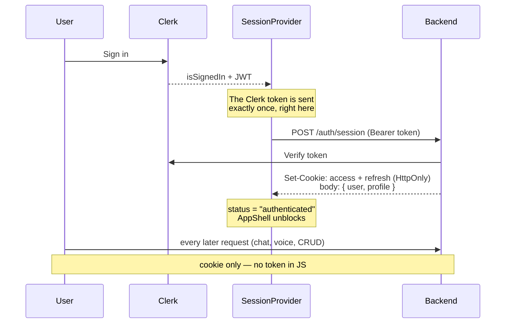

# Frontend Architecture

> **How to read this document.** §1 is the one-paragraph summary. §2 is the map — if you
> read only one section, read that one. §3–§6 go layer by layer from the outside in.
> §7 is authentication, which sits in front of everything else. §8 collects the design
> decisions and the reasoning behind each one, and is the most useful section if you are
> learning from this codebase rather than working on it.
>
> Streaming and tool approval have their own document:
> [streaming-and-hil.md](streaming-and-hil.md). Request-by-request API contracts are in
> [workflow.md](workflow.md).

---

## 1. What this is

A **streaming chat client** for a retrieval-augmented backend. The user types (or
speaks) a question; the answer arrives token by token; the conversation persists across
reloads; and when the assistant wants to run a tool, the UI stops and asks permission
first.

Four ideas do most of the work:

| Idea | In one line |
|---|---|
| **Streaming** | The answer is rendered as it arrives, never awaited as a whole. |
| **Two kinds of state** | Server data is a *cache* (TanStack Query); live UI state is a *store* (Zustand). Never both. |
| **Identity is a cookie** | Clerk proves who you are once; after that every request rides an HttpOnly cookie no script can read. |
| **The graph can pause** | A turn is not always one request — a tool approval splits it into two. |

---

## 2. The map



Three transports, three different reasons:

| Transport | File | Used for | Why not the others |
|---|---|---|---|
| **fetch + SSE** | `lib/stream.ts` | Chat turns | Axios cannot stream a response body incrementally. |
| **axios** | `lib/api.ts` | Everything else (CRUD) | Interceptors give single-flight token refresh and retry for free. |
| **WebSocket** | `lib/voice-socket.ts` | Voice | Audio must flow both ways at once. |

---

## 3. The provider tree

From `src/app/layout.tsx`. **The order is load-bearing**, and getting it wrong produces
failures that look unrelated to nesting:

```
ClerkProvider          ← outermost; SessionProvider calls useAuth()
└── Providers          ← theme + react-query; everything below needs them
    └── SessionProvider  ← exchanges the Clerk token for backend cookies
        └── AppShell      ← picks the frame, and blocks until that exchange finishes
            └── {children}
```

`{children}` appears **exactly once**, inside `AppShell`. It was once rendered twice —
inside `<main>` and again after the header — which mounted every page and every one of
its effects two times over.

### What AppShell decides

| Condition | Renders |
|---|---|
| On `/sign-in` or `/sign-up` | The page bare — no sidebar, no session gate. Requiring a session to sign in would deadlock. |
| Clerk still loading | A spinner. Rendering now would flash a signed-out frame at someone who is signed in. |
| Signed out | Sidebar in its signed-out state + the page. `/` is public; `proxy.ts` blocks the rest. |
| Signed in, exchange pending | "Preparing your workspace". **This is the important one** — it stops any child from firing a request before the cookie exists. |
| Exchange failed | An error panel with a retry button. |
| Ready | Sidebar + page. |

---

## 4. Routing

Next.js **App Router**. Every page here is a Client Component: they all read Zustand
stores or Clerk context, neither of which exists on the server.

| Route | File | Public? | Notes |
|---|---|---|---|
| `/` | `app/page.tsx` | ✅ | Welcome screen with suggested prompts, or the live chat once a turn is in flight. |
| `/c/[id]` | `app/c/[id]/page.tsx` | 🔒 | Loads history on arrival — *unless* a stream is already running (see §8.3). |
| `/connectors` | `app/connectors/page.tsx` | 🔒 | Static catalogue; every provider is "coming soon". No network call. |
| `/profile` | `app/profile/page.tsx` | 🔒 | Profile editing via `/auth/me`. |
| `/sign-in`, `/sign-up` | `app/sign-in/[[...sign-in]]` | ✅ | Clerk-hosted, catch-all segments. |

### proxy.ts — not middleware.ts

Next.js 16 renamed `middleware.ts` to **`proxy.ts`**. The convention still accepts a
default export, so Clerk's handler drops straight in:

```ts
const isPublicRoute = createRouteMatcher(['/', '/sign-in(.*)', '/sign-up(.*)']);

export default clerkMiddleware(async (auth, req) => {
  if (!isPublicRoute(req)) await auth.protect();
});
```

This file previously exported a bare `clerkMiddleware()`, which attached auth context
but **protected nothing** — every route rendered for signed-out visitors. The
`auth.protect()` call is what actually gates them.

---

## 5. State management

### The split, and how to decide



The question is always: **would a page refresh have to refetch this?** If yes it belongs
in Query, which already handles caching, invalidation and optimistic updates. If it only
exists in this tab right now — half an answer, an unanswered approval prompt — it
belongs in a store.

### chat-store.ts

The centre of the app. One store drives the whole conversation surface.

| Field | Meaning |
|---|---|
| `activeConversationId` | Which thread is open. Adopted **as soon as the response header arrives**, not when the answer finishes — see §8.3. |
| `messages` | Committed messages. Optimistic user message first, assistant message on completion. |
| `isStreaming` | A turn is in flight. Drives the stop button and the typing indicator. |
| `streamingContent` | The answer so far, accumulating token by token. |
| `pendingApproval` | Set when the graph paused for tool approval. Locks the composer. |
| `abortController` | Lets the stop button and `clearChat` actually cancel the fetch. |

Actions: `sendMessage`, `resolveApproval`, `loadConversation`, `finishTurn`, `clearChat`,
`stopStreaming`, `appendMessage` (used by voice, which produces messages elsewhere).

`finishTurn` exists because after an approval the answer arrives across **two separate
HTTP responses** and must land as one message, not two.

### voice-store.ts

A four-state phase machine: `idle → recording → thinking → speaking → idle`.

The `VoiceSession` itself is held in a **module-level variable, not in the store** — it
owns `AudioContext`s and a socket, which are not state and must never be cloned by a
state update.

### sidebar-store.ts

Open/closed. That is all — conversation data moved to TanStack Query.

---

## 6. Components

### The chat surface

```
chat-container          scroll region + autoscroll on new content
├── chat-message[]      committed messages
├── chat-message        the streaming one (live streamingContent)
├── TypingIndicator     streaming started, no tokens yet
└── tool-approval       shown only when pendingApproval is set
```

`chat-container` is deliberately dumb: it reads the store and renders. All the logic
lives in the store and in `lib/stream.ts`.

### chat-message.tsx — markdown

The assistant's answer is markdown, rendered with `react-markdown`. Four pieces are
essential, and each was missing at some point:

1. **`remark-gfm`** — CommonMark has *no table syntax*. Without this plugin a
   `| a | b |` block renders as a literal paragraph of pipes. This is what makes tables
   work at all.
2. **`rehype-raw`** — models emit HTML inside markdown constantly, `<br>` inside a table
   cell most of all, since markdown has no other way to break a line there. Without this
   the tag is escaped and the reader sees a literal `<br>` mid-sentence.
3. **`rehype-sanitize`** — mandatory *because* of (2). See below.
4. **`@tailwindcss/typography`** — registered in `globals.css` with `@plugin` (Tailwind
   v4 reads plugins from CSS; there is no `tailwind.config.js`). Without it every `prose`
   class is a no-op.

```tsx
remarkPlugins={[remarkGfm]}
rehypePlugins={[rehypeRaw, rehypeSanitize]}   // order is the security property
```

**The order is not stylistic.** `rehypeRaw` parses raw HTML into the tree; `rehypeSanitize`
then strips what is dangerous. Reversed, sanitising would run before the HTML existed and
do nothing at all.

Enabling raw HTML is what makes sanitising non-optional. The text being rendered is model
output, and on the RAG path it quotes chunks retrieved from **uploaded documents** — so a
poisoned PDF could otherwise place an `` on the page and fire requests that
carry the user's session cookie. `rehype-sanitize`'s default (GitHub) schema fits as-is:
it permits `<br>` and the table elements, drops `<script>`, `<iframe>`, `<style>`, `<form>`,
`<svg>`, `<object>` and every `on*` handler, restricts `href`/`src` to safe protocols
(no `javascript:`, no `data:text/html`), and still keeps `className="language-*"` on
`<code>` — which is exactly what `CodeBlock` reads to label a fenced block.

> One deliberate survivor: `<input>` is allowed, but forced to a **disabled checkbox**.
> That is the GitHub schema supporting GFM task lists (`- [x] done`). With `<form>`
> stripped it has nothing to submit to and cannot be interacted with.

The plugin's own greys are rebound onto the app's tokens in `globals.css`, so
`dark:prose-invert` is unnecessary — the tokens already flip with the `.light` class.

> ### ⚠️ The prose override block must stay **unlayered**
>
> It was once wrapped in `@layer base`, and every declaration in it was silently dead.
> The plugin emits its own `.prose { --tw-prose-*: … }` into `@layer utilities`, and
> **`utilities` beats `base`** — so the real values were the plugin's greys:
>
> | | intended | actually applied | on `#0F0F14` |
> |---|---|---|---|
> | `--tw-prose-body` | `#F5F5F7` | `#364153` | **1.8 : 1** |
> | `--tw-prose-headings` | `#F5F5F7` | `#101828` | **1.1 : 1** |
>
> Against a 4.5 : 1 requirement, headings were effectively invisible. Only dark mode was
> affected — in light mode the plugin's dark greys sit on `#FAFAFC` and read fine — which
> is why it survived review.
>
> Unlayered author styles outrank *every* cascade layer, so keeping the block outside
> `@layer` is what makes it win deterministically. Ordering it inside `utilities` would
> depend on emission order and could break again on a Tailwind upgrade. **Do not "tidy"
> it back into a layer.** Measured after the fix: 17.5 : 1 in dark, 17.3 : 1 in light.

A `components` map then overrides the elements that need real design work:

| Element | Treatment |
|---|---|
| `table` | Wrapped in an `overflow-x-auto` bordered box. **Wide tables scroll inside their own container; the page never scrolls sideways.** |
| `br` | Passes through from raw HTML. Common inside table cells, where markdown offers no other line break. |
| `th` / `td` | Shaded header row, hairline row separators, top-aligned cells. |
| `pre` | ChatGPT-style block: a header bar with the language and its own copy button. |
| `code` (inline) | Subtle chip. Distinguished from a fenced block by the absence of a `language-*` class. |
| `h1`–`h3`, `blockquote`, `hr`, `strong` | Explicit sizes and weights. |

The message-level copy button reveals on `group-hover`, which requires the wrapper to
carry `group` — it did not, so the button was invisible for the life of the component.
It also has `focus-visible:opacity-100` for keyboard users and stays visible at mobile
widths, where there is no hover at all.

### tool-approval.tsx

Covered in [streaming-and-hil.md](streaming-and-hil.md). It is rendered **inline in the
thread rather than as a modal**, because the model usually says something ("Let me look
that up…") before it asks, and a modal would cover exactly the context needed to decide.

---

## 7. Authentication

Two systems with two different jobs:

- **Clerk** is the *identity provider*: it proves who someone is.
- **The FastAPI backend** is the *session authority*: it decides whether they may act,
  and enforces `is_banned` / `is_verified` on every request.



**Why the gate matters.** Firing requests as soon as Clerk reports signed-in would race
the cookie exchange, and every one of them would 401. `AppShell` blocks rendering until
`status === "authenticated"`, so no child can make that mistake.

### Token refresh: single-flight

The access token is short-lived. When it lapses, a page load fires several requests at
once and produces a **burst of simultaneous 401s**. Refresh tokens rotate and are
single-use, so a naive implementation would have the second request present an
already-spent token — which the backend correctly reads as theft and punishes by
revoking the whole family. The user would be logged out for loading a busy page.

`api.ts` holds **one shared in-flight promise**, so the burst produces exactly one
rotation:

```ts
let refreshPromise: Promise<boolean> | null = null;

async function refreshSession() {
  if (!refreshPromise) {
    refreshPromise = axios.post(`${API_BASE_URL}/auth/refresh`, null, { withCredentials: true })
      .then(() => true).catch(() => false)
      .finally(() => { refreshPromise = null; });
  }
  return refreshPromise;
}
```

`stream.ts` implements the same policy separately, because it uses fetch rather than
axios and never passes through the interceptor.

### Account switching

The Zustand stores are module-level singletons, so signing out and in as someone else in
the same tab would leave the previous user's conversations on screen. `SessionProvider`
tracks `loadedUserId` and wipes client state when it changes — keyed on the user id
rather than on sign-out, so it also covers a direct account switch where `isSignedIn`
never flips to false.

---

## 8. Design decisions

### 8.1 Why `/` is public

For a chatbot the interface *is* the pitch, so a signed-out visitor sees the real UI
rather than a wall. The gate is at **submit**, not at page load: the draft is stashed in
`sessionStorage`, the user is sent to sign-in, and the prompt replays when they return —
so the detour costs them nothing they typed.

Replay waits on the **backend** session, not Clerk's. Firing as soon as Clerk reports
signed-in would race the cookie exchange and 401.

`pending-prompt.ts` uses `sessionStorage`, not `localStorage`: this is scoped to one tab
and one detour, and a draft that outlived the browser session would resurface days later
and send a message the user had forgotten writing. It also has a 30-minute cap, and
*consumes on read* so a double-mount cannot send the same message twice.

### 8.2 Three transports, not one

Not an oversight. Axios cannot stream a response body incrementally, so chat has to use
fetch. But fetch has no interceptors, so CRUD would have to hand-roll refresh and retry.
Each transport is used where it is actually better, and `stream.ts` re-implements the
refresh policy to compensate.

### 8.3 Navigating on the header, not the answer

**The bug this fixes:** sending from `/` used to `await sendMessage(...)` — which
resolves only when the whole stream ends — *before* navigating. So the user watched the
answer generate on `/` and was thrown to `/c/{id}` at the very end. Worse, the store
adopted the conversation id just as late, so arriving at `/c/{id}` looked like a cold
load: `loadConversation` set `messages: []` and refetched a transcript the server had not
finished writing, wiping the turn.

The fix is three coordinated changes, and **all three are required**:

| File | Change |
|---|---|
| `lib/stream.ts` | `onConversationId` fires the instant `X-Conversation-Id` is read, before the body loop. |
| `stores/chat-store.ts` | Adopts the id in that callback, so it is set *before* the navigation. |
| `app/c/[id]/page.tsx` | Skips `loadConversation` while `isStreaming` or `pendingApproval` is set. |
| `app/page.tsx` | Reset is mount-only. Reacting to `activeConversationId` would fire `clearChat()` → `abort()` and kill the very turn being streamed. |

### 8.4 Why the connectors page is static

It used to call `GET /connectors`, `/connectors/github/authorize` and
`DELETE /connectors/github` — **none of which exist on the backend**. The request 404'd,
the axios interceptor raised a "Not found" toast, and the grid sat on skeletons forever.

The catalogue now lives in `lib/connectors.ts` as a constant with every provider marked
`coming_soon`, and no request is made — so the 404 is structurally impossible. The shape
is unchanged, so when MCP lands only the data source moves.

### 8.5 Voice: two audio graphs

Capture and playback run at different sample rates (16 kHz in, 24 kHz out) and neither
should stall the other, so they use separate `AudioContext`s:

```
mic → AudioContext(16k) → pcm-worklet → Int16 → ws.send (binary)
ws  → Int16 → Float32 → AudioBuffer(24k) → scheduled playback
```

Binary frames are always audio; text frames are always JSON control messages — no
envelope is needed because the two can never be confused.

Playback chunks arrive **faster than real time**, so each is scheduled to begin where the
previous one ends rather than "now"; playing them immediately would overlap them into
noise.

### 8.6 React 19 and the compiler

The ESLint config includes React Compiler rules, which are stricter than habit:

- **`setState` in an effect body is an error.** Where a reset is needed per-item, key the
  component instead — `tool-approval` is keyed on the pending tool-call id, so a new
  prompt gets a clean card with no effect involved.
- **Refs are plain props.** `ui/textarea.tsx` takes `React.ComponentProps<"textarea">`
  and spreads it; no `forwardRef` needed.

---

## 9. Where to look for what

| Question | File |
|---|---|
| How does a message get sent? | `stores/chat-store.ts` → `sendMessage` |
| How are tokens parsed? | `lib/stream.ts` → `consumeSSE` |
| How does approval work? | `components/chat/tool-approval.tsx` + [streaming-and-hil.md](streaming-and-hil.md) |
| Why is my request 401ing? | `components/auth/session-provider.tsx`, then `lib/api.ts` |
| How do I render a new markdown element? | `components/chat/chat-message.tsx`, the `components` map |
| What colours are available? | `app/globals.css`, and [styles.md](../styles.md) |
| Which routes are public? | `proxy.ts` → `isPublicRoute` |
