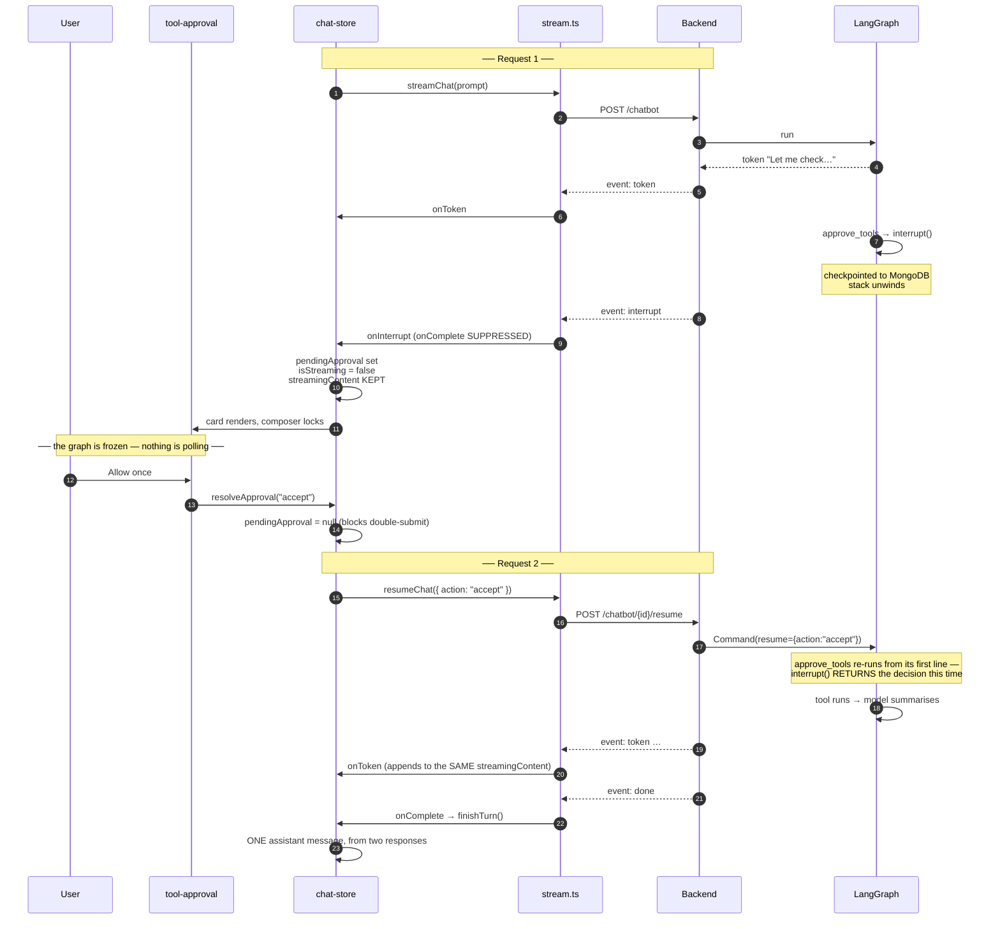

# Streaming & Human-in-the-Loop Approval

> **How to read this document.** §1–§4 are streaming: the wire format, the parser, and
> how tokens reach the screen. §5–§9 are tool approval, which is the reason the wire
> format is as complicated as it is. §10 is testing, §11 is the failure modes.
>
> This is the most intricate part of the frontend. If you only need the shape of the app,
> read [architecture.md](architecture.md) instead.

---

## 1. Why a turn is not one request

The obvious design — POST a question, stream back an answer — breaks the moment the
assistant wants to *do* something rather than just say something.

The backend runs a LangGraph state machine. When it reaches a tool the user must approve,
it calls `interrupt()`, which **checkpoints the graph mid-run and unwinds the whole
stack**. The HTTP response ends. The graph is not cancelled — it is frozen in MongoDB,
waiting.

So one logical turn can be **two HTTP requests**:

```
POST /chatbot                 ──► tokens…  ──► interrupt   (response ends)
                                                  │
                                    user decides ─┤
                                                  ▼
POST /chatbot/{id}/resume     ──► tokens…  ──► done        (turn complete)
```

Everything below follows from that fact.

---

## 2. The wire format

`text/event-stream` with **named events**. Not raw text — a stream that can pause needs
the client to tell the kinds apart, and named events do that with no in-band escaping and
no sentinel string the model could produce by accident.

| Event | Payload | Meaning |
|---|---|---|
| `token` | `{"t": "..."}` | A piece of the answer. |
| `interrupt` | `{"type": "tool_approval", "tool_calls": [...]}` | The run paused. **No `done` will follow.** |
| `truncated` | `{"reason": "length"}` | The answer hit the token ceiling. Sent immediately before `done`. |
| `done` | `{"conversation_id": "..."}` | The turn finished. |
| `error` | `{"detail": "..."}` | Something failed server-side. |

```
event: token
data: {"t": "Let me check"}

event: interrupt
data: {"type": "tool_approval", "tool_calls": [{"id": "fc_1", "name": "get_weather", "args": {"city": "Chennai"}}]}

```

Plus one header, which matters more than it looks:

```
X-Conversation-Id: conv_abc123
```

The body is a token stream with nowhere to put an id, so a brand-new chat learns its own
id from this header — and learns it **before the first token**, which is what makes the
navigation in [architecture.md §8.3](architecture.md#83-navigating-on-the-header-not-the-answer)
possible.

---

## 3. Which tokens actually arrive

Worth knowing, because it explains a class of bug that is invisible from the frontend.

The backend streams via `astream_events` and filters on `langgraph_node`, keeping only
nodes that produce user-facing text:

```python
ANSWER_NODES = {"generate", "tool_llm"}   # unioned from each agent
```

The `router` node is deliberately excluded. It runs a structured-output classifier, and
when the primary model rate-limits and the Gemini fallback takes over, that call streams
its raw JSON — `{"route": "TOOL", "standalone_question": "..."}` — as ordinary content.
Without the filter that JSON is prepended to the user's answer and saved into the
transcript as part of it.

> **If a whole route suddenly renders empty replies, check this set first.** Renaming a
> graph node without updating it drops that route's answer silently — no error anywhere.
> It has happened once already (`call_llm_with_tools` → `tool_llm`), which is why the sets
> now live beside each agent's `add_node` calls rather than in one distant literal.

### Answer length

The backend runs a four-model chain — `mistral-small` → `gpt-oss-20b` →
`deepseek-v4-flash` → `gemini-2.5-flash` — with **two** ceilings, both in the backend's
`app/core/config.py`:

| Setting | Default | Applies to |
|---|---|---|
| `LIGHT_MAX_TOKENS` | **2500** | DeepSeek, Mistral, Gemini — every token is visible |
| `REASONING_MAX_TOKENS` | **4000** | `gpt-oss-20b` — 2500 visible plus ~1400 of headroom for its hidden reasoning, so both tiers land in the same place |

A budget is a hard ceiling: the model stops dead when it is reached, `finish_reason` comes
back `"length"`, and the reply ends mid-word.

A ceiling is not a target, so a generous one is close to free: measured on the light tier,
a two-sentence answer spends 64 tokens and a 200-word one 212, whatever the cap is. Only
answers that genuinely need the room draw on it.

Genuinely open-ended prompts ("deep dive… use tables") will expand to fill whatever budget
they are given and can still be cut — that is what the `truncated` event and the cut-off
notice are for. Both numbers are env-tunable.

On the reasoning overhead: `gpt-oss-20b` spent **1375 reasoning tokens of 3617** on a
measured deep dive, which is why that tier carries ~1400 extra. DeepSeek is configured
with reasoning explicitly **disabled**, so every one of its tokens is visible — measured
at a 600-token cap, reasoning left on yielded only ~270 visible tokens against 600 with it
off, so the flag is worth roughly double the answer.

---

## 4. The client parser — `lib/stream.ts`

Three public functions over one shared engine:

```
streamChat()   POST /chatbot              ─┐
resumeChat()   POST /chatbot/{id}/resume  ─┼─► runStream() ─► consumeSSE()
fetchPendingApproval()  GET /pending      ─┘   (retry/401)     (parse/dispatch)
```

`streamChat` and `resumeChat` differ **only in the request**. Everything after the
response headers — retry policy, 401-refresh-and-replay, SSE parsing — is identical,
which is why it lives in `runStream` rather than being written twice.

### The handlers

```ts
interface StreamHandlers {
  onToken:          (token: string) => void;
  onInterrupt?:     (data: ToolApprovalRequest) => void;
  onComplete:       () => void;
  onError:          (error: Error) => void;
  onUnauthorized?:  () => void;
  onConversationId?: (id: string) => void;   // fired on the header
  signal?:          AbortSignal;
}
```

### The one subtle rule

```ts
let interrupted = false;
// … on an `interrupt` event: interrupted = true

if (!interrupted) {
  handlers.onComplete();
}
```

**An interrupt is not a completed turn.** Calling `onComplete` would make the store commit
a half-finished assistant message — one the backend deliberately did *not* persist,
precisely so the transcript does not end up with a stub ("Let me check that for you…")
that the real answer then appears *after*.

### Parsing

A hand-rolled line reader rather than `EventSource`, for two reasons: `EventSource`
cannot POST, and it cannot send credentials the way this needs. The loop handles `\r\n`,
buffers partial lines across chunk boundaries, and flushes whatever remains at EOF.

---

## 5. The approval round trip



Three things to notice:

1. **The question is not resent.** It is still in the checkpoint. `Command(resume=…)`
   reloads the graph and re-runs the interrupted node.
2. **`approve_tools` re-executes from its first line**, and `interrupt()` returns the
   decision instead of raising. Nothing above it in that node may have a side effect —
   it all runs twice.
3. **`streamingContent` is never cleared between the two requests**, which is what makes
   the answer land as one message.

---

## 6. Store state

```ts
pendingApproval: ToolApprovalRequest | null
```

| Transition | Fires when |
|---|---|
| `null → set` | `onInterrupt`, or `loadConversation` finds a pending prompt on arrival. |
| `set → null` | `resolveApproval` (before the request), `finishTurn`, `clearChat`, `stopStreaming`. |

**Why `streamingContent` survives an interrupt.** The model usually narrates before it
asks — "Let me check that for you…". Clearing it would throw that away and leave the card
floating with no context. Keeping it means the card appears directly underneath, reading
as one continuous thought.

**Why `pendingApproval` is cleared *before* the resume request.** It is what blocks a
double-submit. A second resume would reach a thread that is no longer waiting, and the
backend answers that with a 409.

---

## 7. The card — `tool-approval.tsx`

```
┌─ 🛡 Approval required ───────── A tool wants to run ─┐
│                                                      │
│  🔧 get_weather                                      │
│  ┌────────────────────────────────────────────────┐  │
│  │ {                                              │  │
│  │   "city": "Chennai"                            │  │
│  │ }                                              │  │
│  └────────────────────────────────────────────────┘  │
│                                                      │
│  [ ✓ Allow once ]  [ ✕ Reject ]   This runs on your  │
│                                        behalf        │
└──────────────────────────────────────────────────────┘
```

Reject reveals a reason box (Enter sends, Escape goes back). The reason is passed to the
model on the refusal path, so it can acknowledge *why* rather than ignore it.

### Design decisions

| Decision | Reason |
|---|---|
| **Inline, not a modal** | The model narrates before it asks. A modal would cover exactly the context needed to decide. |
| **Multiple calls, one action row** | The backend gates them as a group and closes out every pending id together — there is no per-call decision to make. |
| **Buttons disable on submit** | A double-click would send a second resume and 409. |
| **Keyed on the pending call id** | Resets the reason draft between prompts in the same turn — without a `setState`-in-effect, which the React Compiler rules reject. |
| **`JSON.stringify(args, null, 2)` in a `<pre>`** | Arguments are model output. They are rendered as text, never as markup. |
| **Composer locks while open** | The turn is genuinely blocked. Typing a new prompt would orphan the interrupt. |

---

## 8. Surviving a reload

The graph state is in MongoDB, so an approval outlives the browser tab — but the *card*
is client state and does not. Without a recovery path, a refresh mid-approval shows a
conversation that just stops mid-sentence, with no way to discover a prompt is still open.

`loadConversation` therefore makes a second request:

```ts
const { data } = await api.get(`/conversations/${id}`);   // transcript
const pending = await fetchPendingApproval(id);           // GET /chatbot/{id}/pending
set({ messages: data.messages, pendingApproval: pending });
```

`GET /pending` reads the checkpoint **without advancing it**. On the backend this needs a
recursive walk — `interrupt()` fires inside the `tool_agent` *subgraph*, so the pending
value hangs off the subgraph's task, not the supervisor's. A one-level lookup returns
`null`, which is indistinguishable from "not waiting on anything".

`fetchPendingApproval` swallows its own errors and returns `null`: a failure here should
cost you the card, not the conversation.

---

## 9. What the backend does with the decision

| Decision | Backend behaviour | What the user sees |
|---|---|---|
| `{action: "accept"}` | `Command(goto="tools")` → ToolNode runs → result returns to the model. | The answer continues, now using the tool result. |
| `{action: "reject", reason?}` | A denial `ToolMessage` is written **for every pending call id**, `route` flips to `DIRECT`, `denied_tools` is set; the supervisor routes to `generate`. | An answer from the model's own knowledge, saying it could not look it up. |
| Anything else | Treated as a refusal. | Same as reject. |

Two backend details that explain the UI:

- **Fail closed.** Anything that is not an explicit `"accept"` is a refusal, so a
  malformed resume payload cannot run a gated tool.
- **Every pending id gets a `ToolMessage`**, not just the gated one. An `AIMessage` whose
  `tool_calls` are not all answered is invalid history — the next provider call fails with
  a 400 rather than degrading.

The tool is **not** retried after a refusal. The user already said no once.

---

## 10. Testing it

### Enable gating

```bash
# backend .env
HITL_TOOLS=get_weather
```

Restart the backend; it logs `Tool approval required for: get_weather` at startup. An
empty `HITL_TOOLS` disables gating entirely and tools run without asking.

### Manual checklist

Ask *"What's the weather in Chennai?"*, then verify:

- [ ] The card appears inline with `get_weather` and `{"city": "Chennai"}`.
- [ ] The composer is disabled and reads "Approve or reject the tool call above…".
- [ ] **Allow once** → the tool runs and the answer continues in the *same* message.
- [ ] A fresh chat → **Reject** with a reason → the answer says it could not look it up.
- [ ] **Refresh the page while the card is up** → the card comes back.
- [ ] Double-click **Allow once** → no 409; the button disables on the first click.

### Automated

Two suites were used to validate this work and are worth re-running after changes:

**SSE parser** — mock `fetch` with a synthetic event stream and assert:

| Case | Expectation |
|---|---|
| tokens + `done` | `onComplete` fires exactly once |
| tokens + `interrupt` | `onComplete` does **not** fire; `onInterrupt` does |
| `interrupt` with no tokens | `onConversationId` still fires from the header |

**Backend routes** — with `HITL_TOOLS` unset, drive `stream_chat` directly and assert every
route yields more than zero tokens. This is what catches an `ANSWER_NODES` mismatch (§3),
which is otherwise silent.

---

## 11. Failure modes and their symptoms

| Symptom | Likely cause |
|---|---|
| A whole route returns an empty reply | `ANSWER_NODES` does not match a renamed graph node (§3). |
| An answer stops mid-word, no error | Hit `LIGHT_MAX_TOKENS` (2500) or `REASONING_MAX_TOKENS` (4000). Confirm with `finish_reason == "length"`; the UI should show the cut-off note. Open-ended prompts can still exhaust any budget. |
| Answers suddenly slow (~3s to first token) | The chain has fallen through to Gemini. Check the startup chain log and whether Mistral is erroring or rate-limiting. |
| A turn hangs with no tokens | Likely the DeepSeek fallback stalling mid-generation — it carries a 60s timeout, after which the chain fails over to Gemini. |
| Answer is cut but no note appears | `onTruncated` not wired through `stream.ts` → store, or `finishTurn` not stamping `partial`. |
| Card never appears, stream just stops | `onInterrupt` not wired through from the store. |
| A stub message appears above the card | `onComplete` not suppressed on interrupt (§4). |
| Card vanishes on refresh | `fetchPendingApproval` not called in `loadConversation` (§8). |
| Resume returns 409 | Nothing pending — usually a double-submit, or another tab answered first. |
| Answer splits into two messages | `streamingContent` cleared between the two requests (§6). |
| Approval works, but a second tool in the same turn shows a stale reason box | The card is not keyed on the pending call id (§7). |
