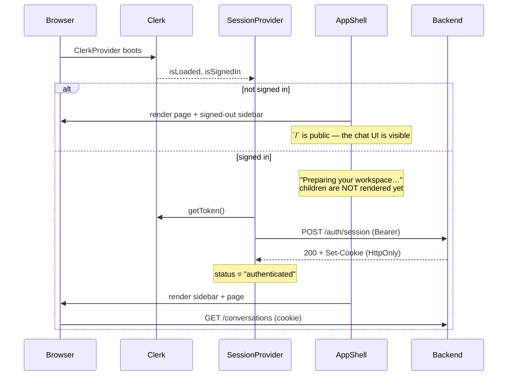
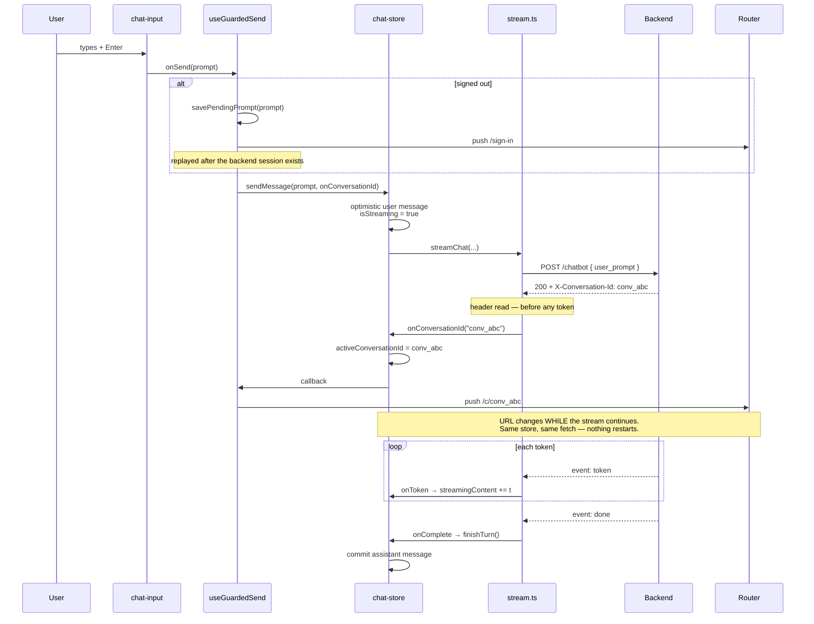
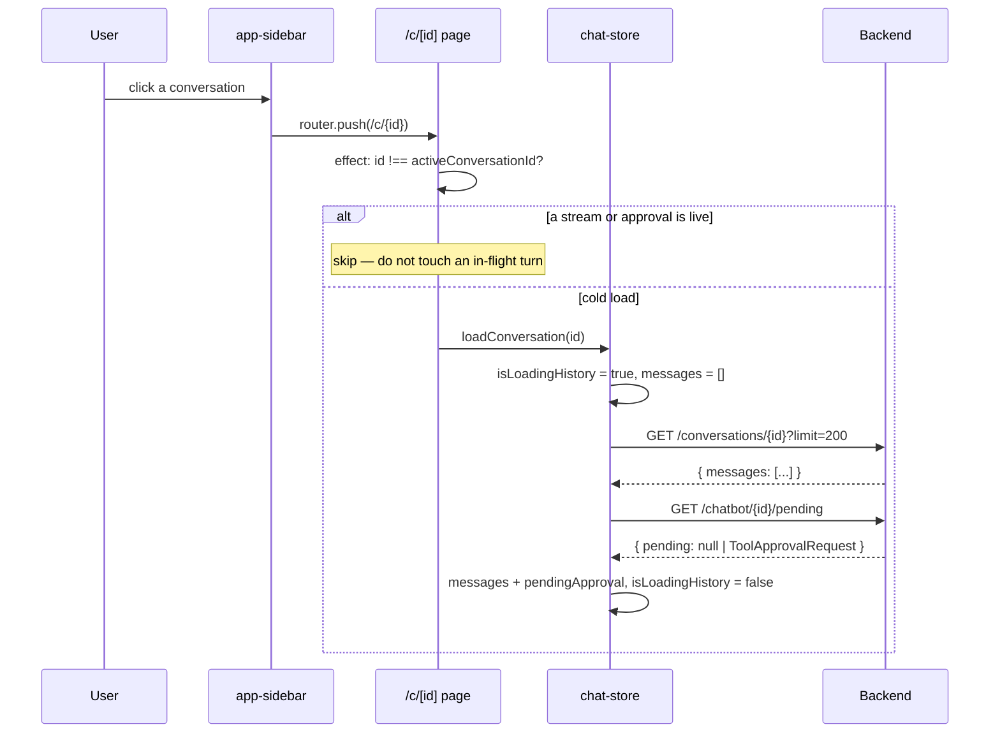
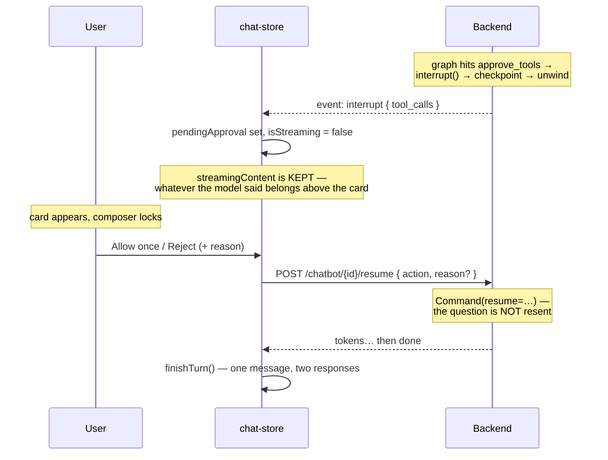
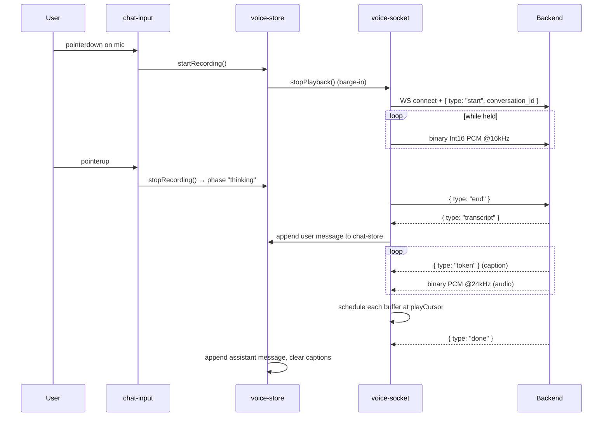
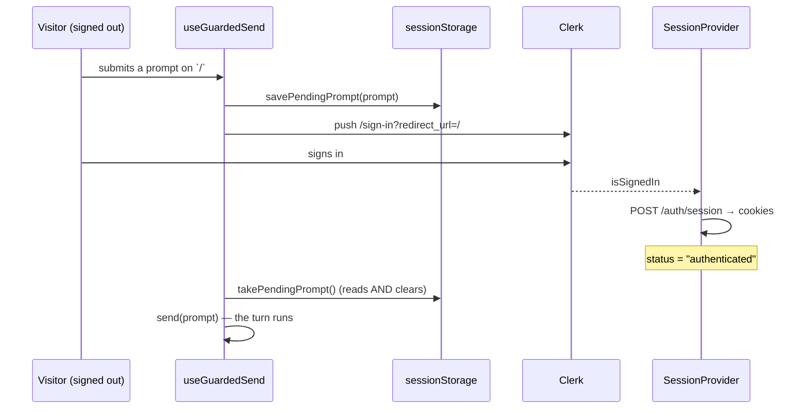
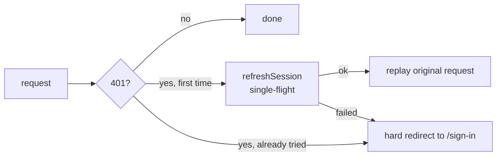

# Frontend Workflows

> **How to read this document.** §1 is the endpoint reference — every call the frontend
> makes. §2–§8 walk through one user journey each, from the click to the database and
> back. §9 is the failure paths, which are where most of the real complexity lives.
>
> For the *shape* of the app, see [architecture.md](architecture.md). For streaming and
> tool approval in depth, see [streaming-and-hil.md](streaming-and-hil.md).

---

## 1. Every call the frontend makes

Base URL: `NEXT_PUBLIC_API_URL` (default `http://localhost:8000`).
**Every request sends cookies** (`credentials: "include"` / `withCredentials: true`).
Identity is never in a request body — the backend rejects a `user_id` field outright.

### Auth

| Method | Endpoint | Called from | Purpose |
|---|---|---|---|
| `POST` | `/auth/session` | `session-provider.tsx` | Exchange a Clerk JWT for HttpOnly cookies. **The only request that carries a Bearer token.** |
| `POST` | `/auth/refresh` | `api.ts`, `stream.ts` | Rotate an expired access token. Single-flight. |
| `GET` | `/auth/me` | `profile/page.tsx` | Current user + profile. |
| `PATCH` | `/auth/me/profile` | `profile/page.tsx` | Update the editable profile fields. |

### Chat

| Method | Endpoint | Called from | Purpose |
|---|---|---|---|
| `POST` | `/chatbot` | `stream.ts` → `streamChat` | Start a turn. **SSE stream.** Returns `X-Conversation-Id`. |
| `POST` | `/chatbot/{id}/resume` | `stream.ts` → `resumeChat` | Answer a tool-approval prompt. **SSE stream.** |
| `GET` | `/chatbot/{id}/pending` | `stream.ts` → `fetchPendingApproval` | What this thread is waiting on, without advancing it. |

### Conversations

| Method | Endpoint | Called from | Purpose |
|---|---|---|---|
| `GET` | `/conversations?limit=50` | `use-conversations.ts` | Sidebar list. |
| `GET` | `/conversations/{id}?limit=200` | `chat-store.ts` | Full transcript. |
| `PATCH` | `/conversations/{id}` | `use-conversations.ts` | Rename. |
| `DELETE` | `/conversations/{id}` | `use-conversations.ts` | Delete. |

### Voice

| Protocol | Endpoint | Called from | Purpose |
|---|---|---|---|
| `WS` | `/ws/voice` | `voice-socket.ts` | Bidirectional audio. Binary = PCM, text = JSON control. |

> **Not called:** there is no `/connectors` endpoint. That page is entirely static —
> see [architecture.md §8.4](architecture.md#84-why-the-connectors-page-is-static).

---

## 2. First load — becoming authenticated

Nothing else can happen until this finishes.

**Why the block matters.** If children rendered while the exchange was still in flight,
`useConversations` would fire immediately and 401 — the cookie would not exist yet.

**Strict-mode guard.** `SessionProvider` holds an `inFlight` ref, because a double-invoked
effect would establish two sessions and orphan a token family.

---

## 3. Sending a message from a **new** chat

The most intricate flow in the app, because navigation and streaming overlap.

**The three guards that make this work** — all required, fixing one alone leaves the bug:

1. `chat-store` adopts the id **in the header callback**, so it is set before navigation.
2. `/c/[id]` skips `loadConversation` while `isStreaming` — otherwise arriving mid-stream
   looks like a cold load and blanks `messages`.
3. `/` resets **on mount only** — reacting to `activeConversationId` would call
   `clearChat()` → `abort()` and kill the very turn being streamed.

### Sending from an *existing* chat

Simpler: `/c/[id]` calls `sendMessage(prompt)` with no callback. There is no navigation,
because the URL is already right.

---

## 4. Opening a conversation from the sidebar

That second request is what makes a refresh mid-approval land back on the prompt instead
of on a conversation that appears to stop mid-sentence.

---

## 5. The sidebar list — TanStack Query

The conversation list is **server data**, so it is a cache, not a store.

| Hook | Behaviour |
|---|---|
| `useConversations(enabled)` | `GET /conversations`, `staleTime: 30s`. `enabled` is false when signed out, which avoids a guaranteed 401. |
| `useOptimisticInsert()` | Puts a new conversation at the top of the cache **immediately**, then revalidates in the background. This is why a new chat appears in the sidebar instantly. |
| `useRenameConversation()` | Optimistic update, rollback on error via the `onMutate` snapshot. |
| `useDeleteConversation()` | Optimistic removal, same rollback. |

All four share the key `["conversations"]`, so any mutation can invalidate the list.

---

## 6. Tool approval

Summarised here; the full treatment is in
[streaming-and-hil.md](streaming-and-hil.md).

---

## 7. Voice — push to talk

Pointer capture keeps `pointerup` on the button even if the finger slides off — without
it the mic would stay open forever. `Escape` cancels the utterance instead of sending it.

Tokens arrive well ahead of their audio, so the caption is rendered live to make the wait
legible.

---

## 8. Sign-in detour and replay

Two safeguards: the effect waits on `status === "authenticated"` (the **backend** session,
not Clerk's, or the request would 401), and a `replayed` ref plus consume-on-read makes
replay idempotent, so a double render cannot send the message twice.

---

## 9. Failure paths

### 401 mid-session

The redirect is a **full page load**, not `router.push` — the session is gone, so tearing
down every in-memory store and cache is the point. A soft push would leave the previous
user's conversations sitting in Zustand.

### Network errors and 5xx

`api.ts` and `stream.ts` both retry up to 3 times with exponential backoff (1s → 2s → 4s),
**only** for network failures and 5xx. A 4xx is a decision, not a glitch, and is never
retried. Axios shows a "retrying (n/3)" toast; the stream logs to the console.

### Aborts

`AbortController` is stored on `chat-store`. `stopStreaming()` and `clearChat()` both
abort it. An `AbortError` returns `null` and is deliberately **not** surfaced as an error
— the user asked for it.

### Error summary

| Status | Handling |
|---|---|
| 401 | One refresh, then replay; else hard redirect to sign-in. |
| 403 | Never retried. Toast with the backend's reason. Signals banned/unverified. |
| 404 | Toast "Not found". |
| 409 | Returned by resume when nothing is pending — usually another tab already answered. |
| 422 | Toast "Invalid request". |
| 5xx / network | Retry ×3 with backoff, then a toast. |

---

## 10. Type contracts

`src/types/` mirrors the backend schemas by hand. **When a backend model changes, these
must change with it** — nothing enforces it at build time.

| Frontend | Backend |
|---|---|
| `types/chat.ts` → `Message`, `Conversation`, `ConversationDetail` | `app/schemas/chat.py` → `MessageOut`, `ConversationOut`, `ConversationDetail` |
| `types/chat.ts` → `ToolDecision`, `ToolApprovalRequest` | `app/schemas/chat.py` → `ToolDecision`; the interrupt payload from `approve_tools` |
| `types/auth.ts` → `AuthUser`, `Profile`, `MeResponse` | `app/schemas/auth.py` |
